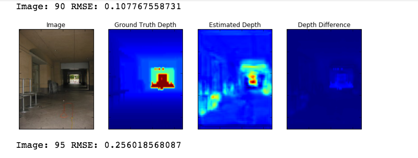

# mono-depth
Experiments with learning depth from a single image for course project.

Details and history in presentation here: https://docs.google.com/presentation/d/1GZkUPq5xFVHfjKiVrPzIXjKb_lBb_r4KPjPVz_VMwK8/edit?usp=sharing

Example Results:

# data
I used data from the Make3d Dataset found here:
http://make3d.cs.cornell.edu/data.html

I organized the data as follows:
The test and training data were downloaded to a directory called "data" and then into subdirectories:

../data/test/depthmaps 

http://www.cs.cornell.edu/~asaxena/learningdepth/Data/Dataset2_Depths.tar.gz

../data/test/images

http://cs.stanford.edu/people/asaxena/learningdepth/Data/Dataset2_Images.tar.gz

../data/train/depthmaps

http://cs.stanford.edu/people/asaxena/learningdepth/Data/Dataset3_Depths.tar.gz

../data/train/images

http://www.cs.cornell.edu/~asaxena/learningdepth/Data/Dataset3_Images.tar.gz

After downloading and extracting the data to the appropriate paths, 
I rotated the images (they are originally flipped 90 degrees from the 
depthmaps and resized them to make the model train more quickly with the 
following commands:

sh resize_and_rotate.sh ../data/train/images/ ../data/train/small_images/

sh resize_and_rotate.sh ../data/test/images/ ../data/test/small_images/

# install
conda env create -f mono_environment.yml

# run
To run with debug statements on cpu:

THEANO_FLAGS="device=cpu,optimizer=None,compute_test_value=raise,floatX=float32" python predict_depth.py

To run on cpu:

THEANO_FLAGS="device=cpu,floatX=float32" python predict_depth.py

To run on gpu with no debug:

THEANO_FLAGS="device=gpu,floatX=float32" python predict_depth.py

# bugs

Error in bottom few rows of pixels 
